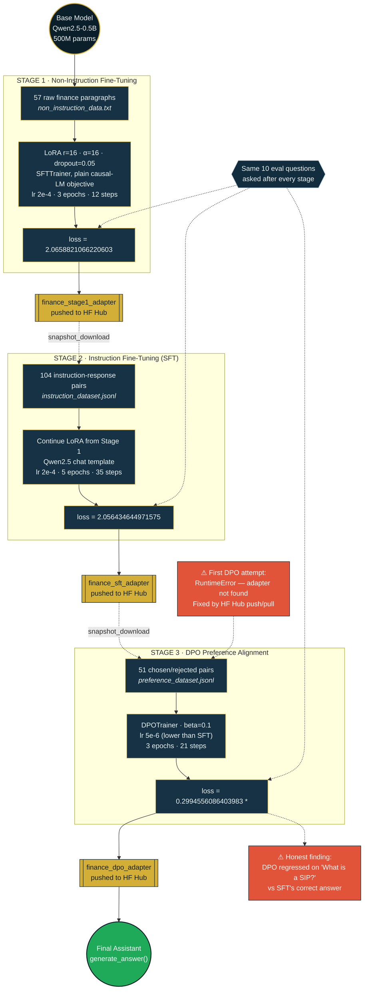

# Fine-Tuning a Finance FAQ Assistant — Architecture (Mermaid)
### by Mayank Chugh · Finance FAQ Assistant Fine-Tuning with Unsloth

Full pipeline: base model → Stage 1 (non-instruction FT) → Stage 2 (SFT) → Stage 3 (DPO) → final assistant.
Adapters are chained between stages via the Hugging Face Hub, not manual re-upload — that distinction is called
out directly in the diagram because it's the fix for a real `RuntimeError` hit during this project.

## Reading the Diagram

- **Gold boxes** are the LoRA adapters — each one is saved locally, then pushed to the Hugging Face Hub so the *next* notebook (a fresh Colab session) can pull it back down reliably.
- **Dashed arrows into the loss nodes** show the same 10 evaluation questions being re-asked after every single stage, which is what keeps the three stages directly comparable.
- **Red boxes** are the two honest findings from this run: the `RuntimeError` that broke the first DPO attempt (fixed via Hub chaining, not manual re-upload), and the DPO regression on the SIP question relative to SFT.
- **Green node** is the final deliverable — the assignment's required `generate_answer()` function, running on the DPO-aligned adapter.

*Made with ❤️ by Mayank Chugh*
